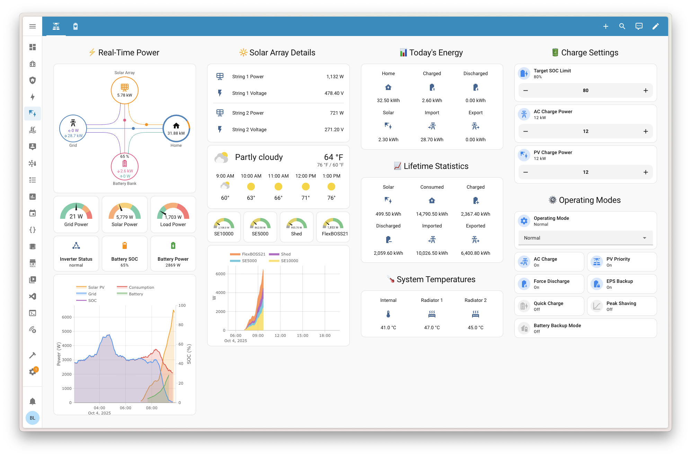
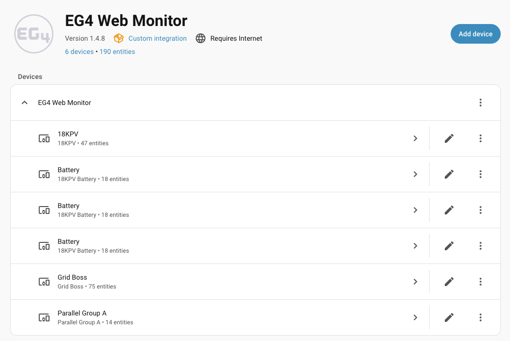

# EG4 Web Monitor Home Assistant Integration

Monitor your EG4 Solar Inverters, GridBOSS devices, and battery systems directly in Home Assistant.

## 🙏 Credits

This integration was inspired by and built upon the excellent work by [@twistedroutes](https://github.com/twistedroutes) and their [eg4_inverter_ha](https://github.com/twistedroutes/eg4_inverter_ha) project. We extend our sincere gratitude for their pioneering efforts in EG4 device integration for Home Assistant.

[![GitHub Release][releases-shield]][releases]
[![License][license-shield]](LICENSE)
[![HACS][hacsbadge]][hacs]
[![CI][ci-badge]][ci-workflow]
[![Project Maintenance][maintenance-shield]][user_profile]
[![BuyMeCoffee][buymecoffeebadge]][buymecoffee]

[](dashboards/eg4_solar_monitor.yaml)

## 🏆 Quality Tier: Platinum Certified

This integration meets the **Platinum tier** quality standards for Home Assistant integrations - the highest level achievable. This ensures:

**Platinum Requirements:**
- 🏆 Fully async dependencies (aiohttp)
- 🏆 Websession injection support
- 🏆 Strict typing with mypy

**Gold Requirements:**
- ✅ Full translation support (multiple languages)
- ✅ Easy reconfiguration through the UI
- ✅ Comprehensive automated testing
- ✅ Extensive user-friendly documentation
- ✅ Professional error handling and logging

Plus all Silver and Bronze tier requirements (36 total requirements met)!

## What Does This Integration Do?

This integration connects your EG4 solar equipment to Home Assistant, allowing you to:

- **See Real-Time Data**: View your solar production, battery levels, grid usage, and power consumption
- **Control Your System**: Turn on quick charging, enable battery backup mode, adjust charge limits
- **Create Automations**: Automatically respond to changing energy conditions
- **Track Energy Usage**: Monitor daily, monthly, and lifetime energy statistics
- **Manage Multiple Sites**: Monitor multiple solar installations from one Home Assistant instance

No technical knowledge of solar systems is required - if you can use the EG4 Monitor app, you can use this integration!

## Features

- **Complete Device Support**: FlexBOSS, 18KPV, 12KPV, XP inverters, GridBOSS, and individual batteries
- **Real-time Monitoring**: Power, voltage, current, temperature, frequency, and energy statistics
- **Control & Automation**: Quick charge, battery backup (EPS), operating modes, and SOC limits
- **Multi-Station Support**: Monitor multiple solar installations from one account
- **GridBOSS Integration**: Grid management, smart load ports, AC coupling, and generator monitoring
- **Multi-Language Support**: User interface available in multiple languages



## Prerequisites

Before installing this integration, you need:

1. **EG4 Solar Equipment**: At least one EG4 inverter that's connected to the EG4 Monitor cloud service
2. **EG4 Monitor Account**: An active account on [monitor.eg4electronics.com](https://monitor.eg4electronics.com)
   - Your devices should be visible in the EG4 Monitor mobile app or website
   - Note your username and password - you'll need them during setup
3. **Home Assistant**: Version 2024.1 or newer
4. **HACS** (recommended): For easy installation and automatic updates

## Installation

### HACS (Recommended)

1. Open HACS → Integrations
2. Search for "EG4 Web Monitor"
3. Click **Download**
4. Restart Home Assistant

> **Note:** If you don't see "EG4 Web Monitor" in the search results, you can add it manually:
> 1. Click ⋮ (three dots) → **Custom repositories**
> 2. Add `https://github.com/joyfulhouse/eg4_web_monitor` with category **Integration**
> 3. Search again and install

### Manual Installation

```bash
# Clone to a temporary location
cd /tmp
git clone https://github.com/joyfulhouse/eg4_web_monitor.git

# Copy the integration to your custom_components folder
cp -r /tmp/eg4_web_monitor/custom_components/eg4_web_monitor /config/custom_components/

# Clean up
rm -rf /tmp/eg4_web_monitor
```

Restart Home Assistant after installation.

> **Note:** The repository contains a `custom_components/eg4_web_monitor/` subdirectory. You must copy this inner directory to your Home Assistant `custom_components` folder, not the entire repository.

## Connection Types

This integration supports four connection methods:

| Connection Type | Description | Update Speed | Internet Required |
|-----------------|-------------|--------------|-------------------|
| **Cloud API (HTTP)** | Connect via EG4's cloud service | 30 seconds | Yes |
| **Local Modbus TCP** | Direct RS485 connection via adapter | 5 seconds | No |
| **WiFi Dongle** | Direct connection via inverter's WiFi dongle | 5 seconds | No |
| **Hybrid** | Local polling + Cloud for battery data | 5 seconds | Yes (for batteries) |

### Cloud API (HTTP) - Easiest Setup

The default connection method. Uses your EG4 Monitor account credentials to communicate with EG4's cloud servers. Best for most users.

**Pros:** No additional hardware needed, works anywhere with internet
**Cons:** Requires internet, 30-second update interval, depends on EG4 servers

### Local Modbus TCP with Waveshare RS485 Adapter

For users who want faster updates and local-only operation, you can connect directly to your inverter using an RS485-to-Ethernet adapter like the Waveshare RS485 to ETH (B).

#### Hardware Requirements

- **RS485 to Ethernet Adapter** - Choose one:
  - **Waveshare RS485 to ETH (B)** - 1 channel (~$25) - [Amazon](https://amzn.to/3NPanIx)
  - **Waveshare RS485 to ETH (B) 4CH** - 4 channels (~$45) - [Amazon](https://amzn.to/45whonI) - *Best for multiple inverters*
- **RS485 cable** - 2-wire twisted pair, options:
  - Use spare CAT5/CAT6 cable (1 twisted pair)
  - **Shielded RS485 cable** (recommended for long runs) - [Amazon](https://amzn.to/4sSOUyp)
- **Ethernet cable** - To connect adapter to your network

> **Tip:** The 4-channel version allows you to connect multiple inverters or other RS485 devices (like energy meters) to a single adapter. For cable runs over 50 feet, use shielded cable to reduce interference.

#### Wiring Diagram

```
EG4 Inverter RS485 Port          Waveshare RS485 to ETH (B)
┌─────────────────────┐          ┌─────────────────────┐
│  RS485-A (Pin 1) ───┼──────────┼── A+ (Terminal)     │
│  RS485-B (Pin 2) ───┼──────────┼── B- (Terminal)     │
│  GND (Pin 3) ───────┼──────────┼── GND (Terminal)    │
└─────────────────────┘          └─────────────────────┘
                                         │
                                         │ Ethernet
                                         ▼
                                   Your Network
```

> **Important:** On EG4 18kPV inverters, the RS485 port is labeled "BMS/Meter" and is located on the bottom of the inverter. Use pins 1 (A), 2 (B), and 3 (GND).

#### Waveshare Configuration

1. Connect the Waveshare adapter to your network via Ethernet
2. Access the web configuration at `http://192.168.1.200` (default IP)
3. Configure the following settings:

**Network Settings:**
- Set a static IP address on your network (e.g., `192.168.1.100`)
- Subnet mask: `255.255.255.0`
- Gateway: Your router IP

**Serial Port Settings:**
- Baud Rate: `19200`
- Data Bits: `8`
- Stop Bits: `1`
- Parity: `None`

**Working Mode:**
- Mode: `TCP Server`
- Local Port: `502` (standard Modbus TCP port)

4. Save and restart the adapter

#### Home Assistant Configuration

During integration setup:
1. Select **"Local Modbus TCP (RS485 adapter)"** as the connection type
2. Enter the Waveshare adapter's IP address (e.g., `192.168.1.100`)
3. Port: `502`
4. Unit ID: `1` (default for most inverters)
5. Enter your inverter's serial number
6. Select your inverter family (PV Series, SNA, or LXP-EU)

### WiFi Dongle Connection

If your inverter has a WiFi dongle, you can connect directly to it on port 8000.

**Requirements:**
- Inverter with WiFi dongle installed
- Dongle connected to your local network
- Dongle serial number (found on the dongle sticker)

> **Note:** Some newer dongle firmware versions may block port 8000 access for security reasons. If connection fails, try the Modbus or Cloud API method instead.

### Hybrid Connection

Combines local polling (Modbus or Dongle) for fast sensor updates with Cloud API for individual battery data.

**Best for:** Users who want fast local updates but also need detailed per-battery monitoring (the cloud API provides individual battery cell data that isn't available via Modbus).

## Configuration

### Initial Setup

1. Navigate to **Settings** → **Devices & Services** in Home Assistant
2. Click the **Add Integration** button (bottom right)
3. Search for **"EG4 Web Monitor"** and select it
4. Enter your EG4 Monitor credentials:
   - **Username**: Your EG4 Monitor account email or username
   - **Password**: Your EG4 Monitor account password
   - **Base URL**: Leave as default (`https://monitor.eg4electronics.com`) unless instructed otherwise
   - **Verify SSL Certificate**: Leave checked (recommended for security)
5. Click **Submit**

If you have multiple solar installations (stations):
- You'll be asked to select which station to monitor
- Each station requires a separate integration instance
- You can add more instances by repeating the setup process

Once configured:
- Your devices will be discovered automatically
- Sensors will appear within a few seconds
- Data updates every 30 seconds by default

### Reconfiguring the Integration

Need to change your credentials or switch to a different station? No problem!

1. Navigate to **Settings** → **Devices & Services**
2. Find your **EG4 Web Monitor** integration
3. Click the three dots (⋮) menu
4. Select **Reconfigure**
5. Update your settings:
   - Change username, password, or connection settings
   - Switch to a different solar installation/station
   - Update SSL verification settings
6. Click **Submit** - your integration will reload with the new settings

The reconfiguration process won't lose any of your existing automations or dashboards!

### Configuring Options (Refresh Intervals)

After initial setup, you can customize polling intervals:

1. Navigate to **Settings** → **Devices & Services**
2. Find your **EG4 Web Monitor** integration
3. Click **Configure**
4. Adjust the settings:
   - **Sensor Update Interval**: How often to poll for sensor data (5-300 seconds)
     - Default: 5 seconds for local connections (Modbus/Dongle), 30 seconds for HTTP
   - **Parameter Refresh Interval**: How often to sync configuration settings (5-1440 minutes)
     - Default: 60 minutes (1 hour)
5. Click **Submit** - the integration will reload with your new settings

> **Tip:** Lower sensor intervals provide faster updates but increase network/API load. For local connections (Modbus/Dongle), 5 seconds is recommended. For cloud API (HTTP), 30 seconds balances responsiveness with server load.

> **⚠️ Important Note About Changing Stations:**
>
> If you switch to a different station/plant during reconfiguration, your entity IDs will change to reflect the new station's devices. This means:
> - Automations referencing the old entity IDs will need to be updated
> - Dashboard cards using old entity IDs will need to be reconfigured
> - History data from the old station will remain but won't be connected to the new entities
>
> If you're only changing credentials (username/password) for the same station, your entity IDs will remain unchanged and all automations will continue working.

## Available Controls

### Switches
- **Quick Charge**: Start/stop battery quick charging
- **Battery Backup (EPS)**: Enable/disable emergency power supply mode
- **Daylight Saving Time**: Enable/disable DST for station time synchronization
- **Working Mode Switches**:
  - **AC Charge Mode**: Enable/disable AC charging from grid
  - **PV Charge Priority**: Enable/disable solar charging priority
  - **Forced Discharge**: Enable/disable forced battery discharge
  - **Peak Shaving Mode**: Enable/disable grid peak shaving
  - **Battery Backup Control**: Enable/disable battery backup controller

### Selects
- **Operating Mode**: Switch between Normal and Standby modes

### Numbers
- **System Charge SOC Limit**: Set battery charge limit (%)
- **AC Charge Power**: Configure AC charging power (0.1 kW increments)
- **PV Charge Power**: Configure PV charging power
- **Grid Peak Shaving Power**: Configure peak shaving power limit
- **Battery Charge Current**: Configure battery charging current
- **Battery Discharge Current**: Configure battery discharging current

### Buttons
- **Refresh Data**: Force refresh for devices and batteries

## Service Actions

### eg4_web_monitor.refresh_data

Force an immediate refresh of device data from the EG4 API, bypassing the normal polling interval.

**Parameters:**
- **entry_id** (optional, string): The configuration entry ID to refresh. If not provided, all EG4 Web Monitor integrations will be refreshed.

**Example usage:**

Refresh a specific integration:
```yaml
service: eg4_web_monitor.refresh_data
data:
  entry_id: "abc123def456"
```

Refresh all EG4 Web Monitor integrations:
```yaml
service: eg4_web_monitor.refresh_data
```

**Use cases:**
- Force immediate data update after changing inverter settings
- Refresh after physical device changes
- Automation triggers requiring fresh data

## Entity Examples

```yaml
# Inverter sensors
sensor.18kpv_1234567890_ac_power
sensor.18kpv_1234567890_battery_charge_power
sensor.18kpv_1234567890_state_of_charge
sensor.18kpv_1234567890_daily_energy

# Battery sensors
sensor.battery_1234567890_01_state_of_charge
sensor.battery_1234567890_01_cell_voltage_delta
sensor.battery_1234567890_01_temperature

# GridBOSS sensors
sensor.gridboss_5555555555_grid_power_l1
sensor.gridboss_5555555555_load_power
sensor.gridboss_5555555555_smart_port1_status

# Basic controls
switch.18kpv_1234567890_quick_charge
switch.18kpv_1234567890_battery_backup
select.18kpv_1234567890_operating_mode
number.18kpv_1234567890_system_charge_soc_limit

# Working mode switches
switch.18kpv_1234567890_ac_charge
switch.18kpv_1234567890_forced_chg_en
switch.18kpv_1234567890_forced_dischg_en
switch.18kpv_1234567890_grid_peak_shaving
switch.18kpv_1234567890_battery_backup_ctrl

# Station controls
switch.eg4_station_daylight_saving_time
```

## Supported Devices

- **Inverters**: FlexBOSS21, FlexBOSS18, 18KPV, 12KPV, XP series
- **GridBOSS**: Microgrid interconnection devices
- **Batteries**: All EG4-compatible battery modules with BMS integration

## Automation Examples

Here are some practical ways to use this integration:

### Automatic Quick Charge During Off-Peak Hours

```yaml
automation:
  - alias: "Charge Batteries During Off-Peak"
    trigger:
      - platform: time
        at: "23:00:00"  # 11 PM - start of off-peak
    action:
      - service: switch.turn_on
        target:
          entity_id: switch.18kpv_1234567890_quick_charge

  - alias: "Stop Quick Charge at Peak Hours"
    trigger:
      - platform: time
        at: "07:00:00"  # 7 AM - end of off-peak
    action:
      - service: switch.turn_off
        target:
          entity_id: switch.18kpv_1234567890_quick_charge
```

### Low Battery Alert

```yaml
automation:
  - alias: "Low Battery Notification"
    trigger:
      - platform: numeric_state
        entity_id: sensor.18kpv_1234567890_state_of_charge
        below: 20
    action:
      - service: notify.mobile_app
        data:
          message: "Battery level is low ({{ states('sensor.18kpv_1234567890_state_of_charge') }}%)"
          title: "Solar Battery Alert"
```

### Enable Battery Backup Mode When Grid Fails

```yaml
automation:
  - alias: "Enable EPS on Grid Failure"
    trigger:
      - platform: numeric_state
        entity_id: sensor.18kpv_1234567890_grid_power
        below: 0.1
        for:
          minutes: 5
    action:
      - service: switch.turn_on
        target:
          entity_id: switch.18kpv_1234567890_battery_backup
```

## Frequently Asked Questions

### How often does the data update?

Update intervals depend on your connection type:
- **Cloud API (HTTP)**: 30 seconds by default
- **Local Modbus/Dongle**: 5 seconds by default
- **Hybrid**: 5 seconds for sensors, cloud API for battery details

You can customize these intervals in the integration options (Settings → Integrations → EG4 → Configure). Range: 5-300 seconds for sensors.

You can also force an immediate update using the "Refresh Data" button or the `eg4_web_monitor.refresh_data` service.

**Note:** If you change settings directly on the EG4 monitoring website (not through Home Assistant), parameter data like working mode switches may take up to an hour to refresh (configurable in options). Press the `button.<model>_<serial>_refresh_data` button to force an immediate parameter sync.

### Can I monitor multiple solar installations?

Yes! Each installation (station) requires a separate integration instance. Just add the integration multiple times and select a different station each time.

### Why are some sensors missing or unavailable?

This is normal! The integration only creates sensors for features your equipment actually has. For example:
- Generator sensors only appear if you have a generator connected
- Some GridBOSS ports may not show up if they're unused
- Battery-specific sensors only appear for batteries connected to your inverters

### Will this work if my internet goes down?

**It depends on your connection type:**

- **Cloud API (HTTP)**: No - requires internet to communicate with EG4's cloud service
- **Local Modbus TCP**: Yes - communicates directly with your inverter via RS485 adapter
- **WiFi Dongle**: Yes - communicates directly with your inverter's WiFi dongle
- **Hybrid**: Partial - sensor data works locally, but battery details require internet

If using cloud API and your internet is down, entities will be marked "unavailable" and will automatically reconnect when internet is restored.

> **Tip:** For maximum reliability, use **Local Modbus TCP** with a Waveshare RS485 adapter. This provides the fastest updates (5 seconds) and works completely offline.

### Does this integration control my inverter?

Yes, for supported features like:
- Quick charge on/off (Cloud API only)
- Battery backup (EPS) mode
- Operating mode (Normal/Standby)
- SOC charge limits
- AC and PV charge power settings
- Charge/discharge current limits

**How controls work by connection type:**
- **Cloud API/Hybrid**: Commands sent through EG4's cloud API (same as mobile app)
- **Local Modbus/Dongle**: Direct register writes to inverter (faster, works offline)

> **Note:** Quick Charge is only available with Cloud API or Hybrid modes because it's a cloud-scheduled task feature, not a local register setting.

### Is this integration secure?

Yes! The integration:
- Uses encrypted HTTPS connections to EG4's servers
- Stores credentials securely in Home Assistant's encrypted storage
- Only communicates with official EG4 API endpoints
- Verifies SSL certificates by default

### What happens if my EG4 Monitor password changes?

Home Assistant will detect the authentication failure and prompt you to re-enter your credentials through the UI. Just click the notification and enter your new password - no need to delete and re-add the integration!

## Troubleshooting

### Enable Debug Logging

If you're experiencing issues, enable detailed logging to help diagnose the problem:

1. Edit your `configuration.yaml` file
2. Add the following:

```yaml
logger:
  default: warning
  logs:
    custom_components.eg4_web_monitor: debug
```

3. Restart Home Assistant
4. Check **Settings** → **System** → **Logs** for detailed information

### Common Issues

#### "Cannot connect to EG4 Web Monitor"

**Possible causes:**
- Internet connection is down
- EG4 servers are temporarily unavailable
- Firewall is blocking access to monitor.eg4electronics.com

**Solutions:**
1. Check your internet connection
2. Try accessing [monitor.eg4electronics.com](https://monitor.eg4electronics.com) in a web browser
3. Check if your firewall allows HTTPS traffic to EG4's servers
4. Wait a few minutes and try again - the integration will automatically retry

#### "Invalid username or password"

**Solutions:**
1. Verify your credentials in the EG4 Monitor mobile app or website
2. Try logging out and back in to the EG4 Monitor app
3. Check for extra spaces in your username or password
4. If you recently changed your password, use the **Reconfigure** option to update it

#### "No solar stations/plants found"

**Possible causes:**
- Your account doesn't have any stations configured yet
- Stations haven't finished syncing to the EG4 cloud

**Solutions:**
1. Log into the EG4 Monitor app and verify your station is visible there
2. Make sure your inverter is connected to the internet and uploading data
3. Wait 5-10 minutes for new stations to fully sync
4. Contact EG4 support if stations don't appear in the mobile app

#### "Entities show as unavailable"

**Possible causes:**
- Internet connection lost
- EG4 API session expired
- Inverter is offline

**Solutions:**
1. Check Home Assistant's internet connection
2. Wait 2-5 minutes - the integration will automatically reconnect
3. Check if your inverter is online in the EG4 Monitor app
4. Use the "Refresh Data" button to force a reconnection
5. If problem persists, try reloading the integration

#### "Some sensors are missing"

This is usually normal! The integration only creates sensors for features your specific equipment supports. For example:

- **GridBOSS sensors**: Only appear if you have a GridBOSS device
- **Battery sensors**: Only for connected battery banks
- **Generator sensors**: Only if a generator is connected
- **Smart port sensors**: Only for configured ports on GridBOSS

**To verify:**
1. Check what sensors appear in the EG4 Monitor mobile app
2. Make sure the missing feature actually exists on your equipment
3. Enable debug logging to see what data the API is providing

### Getting Help

If you're still experiencing issues:

1. **Check existing issues**: [GitHub Issues](https://github.com/joyfulhouse/eg4_web_monitor/issues)
2. **Enable debug logging** and include relevant logs when reporting issues
3. **Provide details**:
   - Your Home Assistant version
   - Your EG4 equipment model(s)
   - Error messages from the logs
   - Steps to reproduce the issue

### Support Channels

- **Bug Reports**: [GitHub Issues](https://github.com/joyfulhouse/eg4_web_monitor/issues)
- **Feature Requests**: [GitHub Issues](https://github.com/joyfulhouse/eg4_web_monitor/issues)
- **Community Discussion**: [Home Assistant Community](https://community.home-assistant.io)
- **General Help**: [Home Assistant Discord](https://discord.gg/home-assistant)

## License

MIT License - see [LICENSE](LICENSE) file for details.

## Disclaimer

Unofficial integration not affiliated with EG4 Electronics. Use at your own risk.

---

**Enjoy monitoring your EG4 solar system!** ☀️

[releases-shield]: https://img.shields.io/github/v/release/joyfulhouse/eg4_web_monitor?style=for-the-badge
[releases]: https://github.com/joyfulhouse/eg4_web_monitor/releases
[license-shield]: https://img.shields.io/github/license/joyfulhouse/eg4_web_monitor?style=for-the-badge
[hacs]: https://hacs.xyz
[hacsbadge]: https://img.shields.io/badge/HACS-Default-41BDF5.svg?style=for-the-badge
[ci-badge]: https://img.shields.io/github/actions/workflow/status/joyfulhouse/eg4_web_monitor/quality-validation.yml?branch=main&label=CI&style=for-the-badge
[ci-workflow]: https://github.com/joyfulhouse/eg4_web_monitor/actions/workflows/quality-validation.yml
[maintenance-shield]: https://img.shields.io/badge/maintainer-joyfulhouse-blue.svg?style=for-the-badge
[user_profile]: https://github.com/joyfulhouse
[buymecoffeebadge]: https://img.shields.io/badge/buy%20me%20a%20coffee-donate-yellow.svg?style=for-the-badge
[buymecoffee]: https://www.buymeacoffee.com/btli
