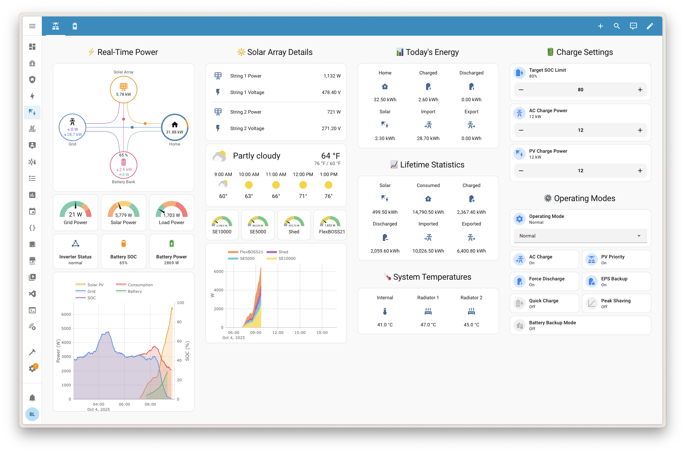
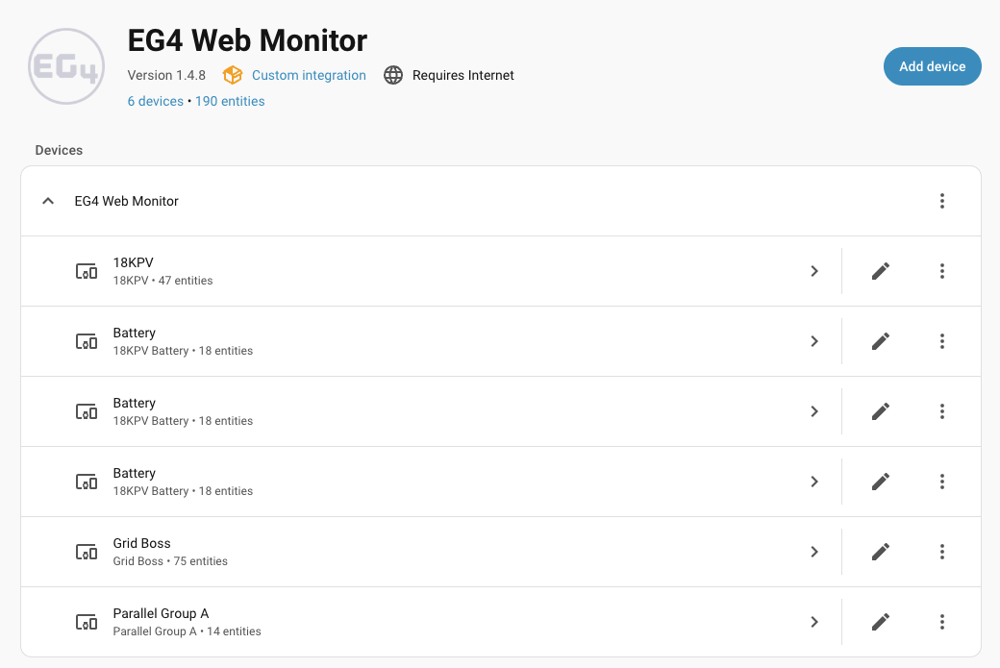

# EG4 Web Monitor

Monitor and control EG4 solar inverters, GridBOSS, and batteries in Home Assistant over local Modbus, WiFi dongle, serial, cloud API, or hybrid connectivity.

[![GitHub Release][releases-shield]][releases]
[![License][license-shield]](LICENSE)
[![HACS][hacs-shield]][hacs]
[![CI][ci-shield]][ci]
[![Quality Scale][quality-shield]][quality]
[![Project Maintenance][maintenance-shield]][maintenance]
[![GitHub Sponsors][sponsors-shield]][sponsors]
[![Ko-fi][kofi-shield]][kofi]

[](dashboards/eg4_solar_monitor.yaml)

## What It Does

This integration connects your EG4 solar equipment to Home Assistant so you can
see real-time production, battery, and grid data, control charging and operating
modes, and build automations around your energy system. It works with the EG4
cloud account you already use, or directly against your hardware over Modbus for
fast, internet-free local polling. No technical knowledge of solar systems is
required — if you can use the EG4 Monitor app, you can use this integration.

## Features

- **Local & cloud connectivity:** Modbus TCP, WiFi dongle, USB/RS485 serial,
  cloud API, or hybrid mode.
- **Broad device support:** FlexBOSS21, FlexBOSS18, 18kPV, 12kPV, XP inverters,
  LXP-EU (three-phase), LXP-LB-BR (Brazil 10kW), GridBOSS, and individual
  batteries.
- **Real-time monitoring:** power, voltage, current, temperature, frequency, and
  energy statistics with split-phase per-leg detail.
- **Fast local polling:** 5-second updates over Modbus, dongle, or serial — no
  internet dependency.
- **Hybrid mode:** enrich local data with cloud-only features such as DST
  auto-sync and quick charge control.
- **Data integrity:** WiFi dongle cross-request validation, canary checks, and
  energy monotonicity guards protect against corrupt readings.
- **Control & automation:** quick charge, battery backup (EPS), operating modes,
  SOC limits, charge/discharge currents, and GridBOSS smart port configuration.
- **BMS diagnostics:** bank-level cell voltage, temperature, current limits, and
  cycle count — always available, no CAN bus needed.
- **Battery tracking:** round-robin battery cache with per-battery last-seen
  timestamps for systems with more than four batteries.
- **Multi-station support:** monitor multiple solar installations from one
  account.
- **Multi-language support:** 12 languages (Chinese Simplified, Chinese
  Traditional, Dutch, French, German, Italian, Japanese, Korean, Polish,
  Portuguese, Russian, Spanish).



## Prerequisites

- **EG4 solar equipment:** at least one EG4 inverter (FlexBOSS, 18kPV, 12kPV, XP)
  or GridBOSS device.
- **A connection method** (at least one):
  - **Cloud:** an active account on
    [monitor.eg4electronics.com](https://monitor.eg4electronics.com).
  - **Local Modbus TCP:** an RS485-to-Ethernet adapter (e.g. Waveshare) wired to
    your inverter.
  - **Serial Modbus (USB/RS485):** a USB-to-RS485 adapter on your Home Assistant
    host.
  - **WiFi dongle:** direct network access to your inverter's WiFi dongle.
- **Home Assistant** 2026.1.0 or newer.
- **HACS** (recommended) for easy installation and updates.

## Installation

See **[INSTALL.md](INSTALL.md)** for the complete guide.

**Quick version (HACS):** add this repository as a custom repository in HACS,
install **EG4 Web Monitor**, restart Home Assistant, then add the integration
from **Settings → Devices & Services**.

[![Open in HACS][hacs-repo-shield]][hacs-repo]

## Configuration

### Connection types

| Connection type | Description | Update speed | Internet required |
|---|---|---|---|
| **Cloud API (HTTP)** | Connect via EG4's cloud service | 30 seconds | Yes |
| **Local Modbus TCP** | Direct RS485 connection via adapter | 5 seconds | No |
| **WiFi dongle** | Direct connection via the inverter's WiFi dongle | 5 seconds | No |
| **Serial Modbus (USB/RS485)** | Direct USB-to-RS485 serial connection | 5 seconds | No |
| **Hybrid** | Local polling + cloud for DST sync & quick charge | 5 seconds | Yes (cloud features) |

The connection type is derived automatically from what you configure: cloud
credentials only → **HTTP** mode; local devices only → **Local** mode; both →
**Hybrid** mode. See [docs/CONFIGURATION.md](docs/CONFIGURATION.md) for the full
setup walkthrough, including Waveshare RS485 wiring and adapter settings, serial
and WiFi dongle setup, options (refresh intervals), and reconfiguration.

### Initial setup

1. Go to **Settings → Devices & Services → Add Integration**.
2. Search for **EG4 Web Monitor** and select it.
3. Choose a starting point:
   - **Cloud (HTTP):** enter your EG4 Monitor credentials and select a station;
     optionally add a local device to create a hybrid connection.
   - **Local Device:** pick Modbus TCP, WiFi Dongle, or Serial (USB/RS485) and
     enter the connection details — the model and serial number are
     auto-detected.

> If you switch to a different station/plant during reconfiguration, entity IDs
> change to reflect the new station's devices, and automations or dashboards that
> reference the old IDs need updating. Changing only credentials for the same
> station leaves entity IDs unchanged.

## Supported Equipment

- **Inverters:** FlexBOSS21, FlexBOSS18, 18kPV, 12kPV, XP series, LXP-EU
  (three-phase), LXP-LB-BR (Brazil 10kW).
- **GridBOSS:** microgrid interconnection devices with smart port configuration.
- **Batteries:** all EG4-compatible battery modules with BMS integration and
  individual cell monitoring.

The integration exposes switches (quick charge, battery backup/EPS, DST, working
modes), selects (operating mode, GridBOSS smart port modes, battery charge/discharge
control mode), numbers (SOC and voltage limits, AC/PV charge power, charge/discharge
currents, PV start voltage, peak shaving), and a refresh-data button, plus a
`eg4_web_monitor.refresh_data` service action. Batteries can be regulated by **SOC**
(default) or **Voltage** — see
[Battery control mode](docs/CONFIGURATION.md#battery-control-mode-soc-vs-voltage)
for the SOC-vs-Voltage limits and the EG4-label cross-reference (e.g. EG4's
*"Back Up Volt(V)"* = the **AC Charge End Voltage** entity). The full entity and
control catalog is documented in
[docs/CONFIGURATION.md](docs/CONFIGURATION.md), and every register-to-sensor and
API-to-sensor mapping is in [docs/DATA_MAPPING.md](docs/DATA_MAPPING.md).

## Automation Examples

### Charge batteries during off-peak hours

```yaml
automation:
  - alias: "Charge Batteries During Off-Peak"
    trigger:
      - platform: time
        at: "23:00:00"
    action:
      - service: switch.turn_on
        target:
          entity_id: switch.18kpv_1234567890_quick_charge

  - alias: "Stop Quick Charge at Peak Hours"
    trigger:
      - platform: time
        at: "07:00:00"
    action:
      - service: switch.turn_off
        target:
          entity_id: switch.18kpv_1234567890_quick_charge
```

### Low battery alert

```yaml
automation:
  - alias: "Low Battery Notification"
    trigger:
      - platform: numeric_state
        entity_id: sensor.18kpv_1234567890_state_of_charge
        below: 20
    action:
      - service: notify.mobile_app
        data:
          message: "Battery level is low ({{ states('sensor.18kpv_1234567890_state_of_charge') }}%)"
          title: "Solar Battery Alert"
```

### Enable battery backup when the grid fails

```yaml
automation:
  - alias: "Enable EPS on Grid Failure"
    trigger:
      - platform: numeric_state
        entity_id: sensor.18kpv_1234567890_grid_power
        below: 0.1
        for:
          minutes: 5
    action:
      - service: switch.turn_on
        target:
          entity_id: switch.18kpv_1234567890_battery_backup
```

## Troubleshooting

Common issues and fixes — including "Cannot connect", "Invalid username or
password", "No stations found", unavailable entities, and missing sensors — are
covered in [docs/TROUBLESHOOTING.md](docs/TROUBLESHOOTING.md).

To enable debug logging, add the following to `configuration.yaml` and restart
Home Assistant:

```yaml
logger:
  default: warning
  logs:
    custom_components.eg4_web_monitor: debug
```

Then check **Settings → System → Logs**.

## Quality Scale

This integration meets the Home Assistant **Platinum** quality tier — the highest
level — with fully async dependencies, websession injection, and strict typing,
plus full translation support, UI reconfiguration, comprehensive automated
testing, and professional error handling and logging.

## Development

This integration is built on the
[pylxpweb](https://github.com/joyfulhouse/pylxpweb) Python library. See
[docs/DEVELOPMENT.md](docs/DEVELOPMENT.md) to set up a development environment,
and [docs/ARCHITECTURE.md](docs/ARCHITECTURE.md) for design and structure.

## Support

- **Issues:** <https://github.com/joyfulhouse/eg4_web_monitor/issues>
- **Discussions / questions:** open an issue with the `question` label.
- **Community:** [Home Assistant Community](https://community.home-assistant.io)
  and [Home Assistant Discord](https://discord.gg/home-assistant).

## Support Development

If this project is useful to you, please consider supporting its development:

- [GitHub Sponsors][sponsors]
- [Ko-fi][kofi]

## License

This project is licensed under the **MIT** License — see [LICENSE](LICENSE) for
details.

This is an unofficial integration and is not affiliated with EG4 Electronics. Use
at your own risk.

## Credits

Built and maintained by [JoyfulHouse](https://github.com/joyfulhouse) with the
[pylxpweb](https://github.com/joyfulhouse/pylxpweb) library.

This integration was inspired by and built upon the work of
[@twistedroutes](https://github.com/twistedroutes) and the
[eg4_inverter_ha](https://github.com/twistedroutes/eg4_inverter_ha) project. We
extend our sincere gratitude for their pioneering efforts in EG4 device
integration for Home Assistant.

<!-- Badge links -->
[releases-shield]: https://img.shields.io/github/release/joyfulhouse/eg4_web_monitor.svg?style=for-the-badge
[releases]: https://github.com/joyfulhouse/eg4_web_monitor/releases
[license-shield]: https://img.shields.io/github/license/joyfulhouse/eg4_web_monitor.svg?style=for-the-badge
[hacs-shield]: https://img.shields.io/badge/HACS-Custom-41BDF5.svg?style=for-the-badge
[hacs]: https://github.com/hacs/integration
[hacs-repo-shield]: https://my.home-assistant.io/badges/hacs_repository.svg
[hacs-repo]: https://my.home-assistant.io/redirect/hacs_repository/?owner=joyfulhouse&repository=eg4_web_monitor&category=integration
[ci-shield]: https://img.shields.io/github/actions/workflow/status/joyfulhouse/eg4_web_monitor/quality-validation.yml?style=for-the-badge&label=CI
[ci]: https://github.com/joyfulhouse/eg4_web_monitor/actions
[quality-shield]: https://img.shields.io/badge/Quality%20Scale-Platinum-5c2d91.svg?style=for-the-badge
[quality]: https://developers.home-assistant.io/docs/core/integration-quality-scale/
[maintenance-shield]: https://img.shields.io/badge/maintainer-%40btli-blue.svg?style=for-the-badge
[maintenance]: https://github.com/btli
[sponsors-shield]: https://img.shields.io/badge/sponsor-GitHub-EA4AAA.svg?style=for-the-badge&logo=githubsponsors&logoColor=white
[sponsors]: https://github.com/sponsors/btli
[kofi-shield]: https://img.shields.io/badge/Ko--fi-donate-FF5E5B.svg?style=for-the-badge&logo=ko-fi&logoColor=white
[kofi]: https://ko-fi.com/bryanli
